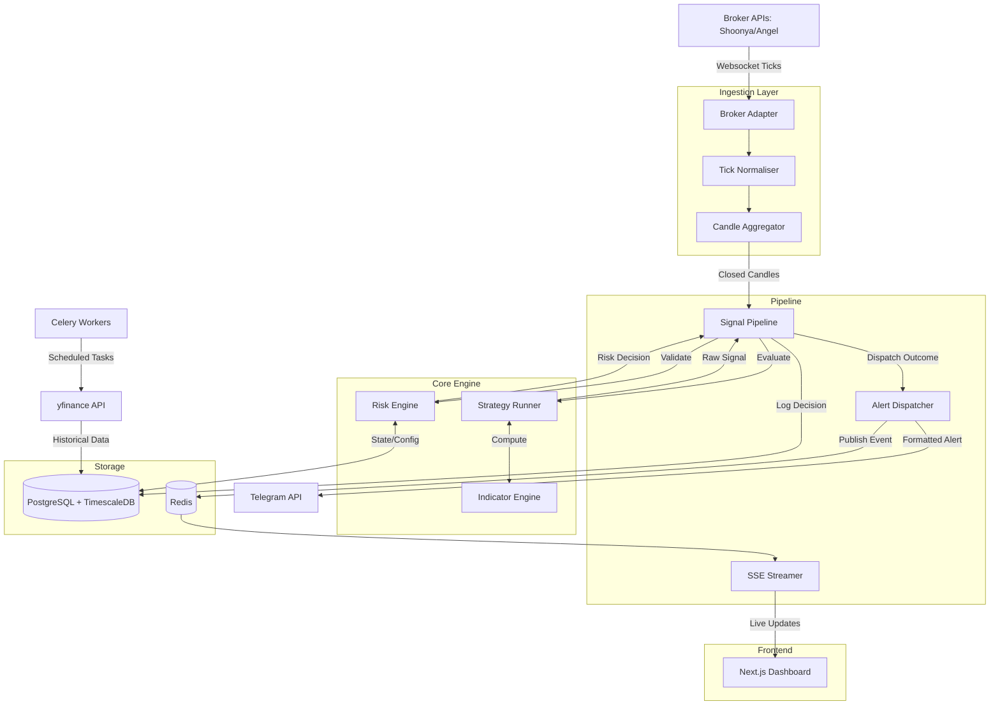

# QuantDSS Architecture & Data Flow

## 1. High-Level Architecture Diagram

## 2. Data Flow Lifecycle

1. **Market Data Ingestion**:
   - The **Broker Adapter** connects to the broker's WebSocket (e.g., Shoonya or Angel) to receive real-time price ticks.
   - The **Tick Normaliser** converts raw broker-specific ticks into a standard JSON format.
   - The **Candle Aggregator** batches these ticks in-memory into 1-minute, 5-minute, or daily OHLCV candles based on active timeframes.

2. **Strategy Evaluation**:
   - Once a candle closes, it is passed to the **Signal Pipeline**, which fetches the historical lookback window from the database.
   - The Pipeline asks the **Strategy Runner** to evaluate the data.
   - The **Indicator Engine** calculates required vectorised indicators (EMA, RSI, ATR) using the pure-Python `ta` library.
   - Strategies (e.g., EMA Crossover) evaluate the indicators against rule-sets and generate an unvalidated `RawSignal` (BUY/SELL).

3. **Risk Validation (Fail-Fast)**:
   - The `RawSignal` is routed to the **Risk Engine**.
   - It checks the system's Daily Risk State and evaluates the signal against 7 sequential rules: **Daily Loss, Drawdown, Cooldown, Volatility (ATR), Position Sizing, Max Position Cap, and Max Concurrent Positions**.
   - If ANY rule fails, the signal receives a `BLOCKED` (hard fail) or `SKIPPED` (soft fail) status. If all rules pass, it is `APPROVED` and assigned a calculated quantity.

4. **Persistence & Alert Dispatch**:
   - The Signal Pipeline logs the final signal, the risk decision, and an audit trail to **PostgreSQL**.
   - The pipeline hands the result to the **Alert Dispatcher**.
   - The Dispatcher publishes the event to **Redis Pub/Sub**, which streams it via **Server-Sent Events (SSE)** directly to the Next.js **Dashboard** for instant UI updates.
   - Concurrently, a formatted message is pushed to the user via the **Telegram Bot** (Note: `SKIPPED` signals are omitted from Telegram to reduce noise).

## 3. Key Architectural Design Points

- **Fail-Fast Risk Engine**: Risk management is enforced stringently. Rules are evaluated sequentially—a hard block (like Daily Loss Limit reached) immediately halts trading globally, refusing subsequent signals without wasting compute cycles.
- **Stateless & Idempotent Evaluation**: The strategy engine is stateless. It recalculates indicators dynamically over a database lookback window rather than maintaining complex, stateful in-memory arrays. This makes it highly resilient to restarts and network drops.
- **Asynchronous & Non-Blocking**: Built entirely on Python's `asyncio` ecosystem (FastAPI, `asyncpg`, continuous Redis pipelines), ensuring that I/O operations (like waiting for database inserts or Telegram HTTP responses) do not block the critical tick aggregation thread.
- **TimescaleDB for Time-Series**: Market data (ticks and candles) are stored in TimescaleDB hypertables. This provides hyper-fast analytical queries and automatic data retention/compression for historical candles.
- **Decision Support, Not Execution**: By design, the system **does not orchestrate automated trading**. It calculates sizes, stop-losses, targets, and enforces limits, but alerts the human trader who must manually click the "execute" button. This forces psychological discipline while removing the math burden.
