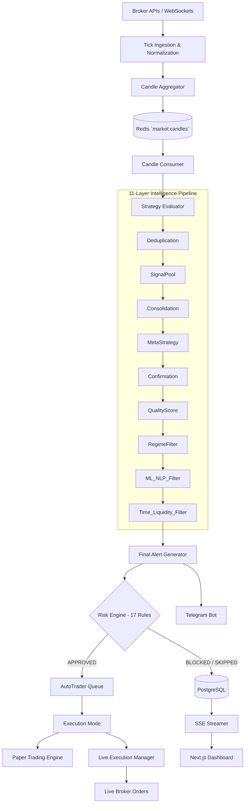

<div align="center">
  <h1>📈 QuantDSS</h1>
  <p><strong>Quantitative Decision Support & Execution System for Intraday Indian Equity Markets</strong></p>
</div>

> **QuantDSS is a discipline-enforcement tool. It does not predict the market. It enforces the rules you already know but fail to follow.**

## 📖 Overview

QuantDSS is a self-hosted, highly sophisticated, zero-cost trading decision support API and dashboard for Indian NSE/BSE cash equities. It acts as an automated intraday trading platform that ingests live market data, evaluates quantitative strategies, filters signals through a rigorous **11-layer intelligence pipeline**, validates risk against **17 hard rules**, and executes trades via broker APIs — all in real time and without emotion.

## ✨ Key Features

- **Live Market Data Ingestion:** Connects directly to broker WebSockets (Upstox/Angel One) for live tick data, aggregating ticks into 1-minute OHLCV candles, and maintains an in-memory LTP cache.
- **Advanced Strategy Engine:** Evaluates multiple parallel strategies including EMA Crossover, RSI Mean Reversion, ORB+VWAP, Volume Expansion, Trend Continuation, VWAP Reclaim, and more.
- **11-Layer Signal Intelligence Pipeline:** A mandatory, fail-fast filtering system that every generated signal must pass through. Features Signal Deduplication, Meta-Strategy Blocking, Confirmation, Quality Scoring, Market Regime Formatting, ML/NLP Predictions, Time Window constraints, and Liquidity checks.
- **Uncompromising Risk Engine:** 17 hard risk rules enforcing max daily loss, peak-to-trough drawdowns, post-loss cooldowns, volatility checks, position sizing parameters, max open positions, and consecutive losses. **No signal bypasses the Risk Engine.**
- **AutoTrader Execution:** Supports both event-driven reactive routing and scheduled scanning modes. Seamlessly switch between **Paper Trading** and **Live Execution** modes using Broker APIs (Shoonya, Upstox, Angel One).
- **Modern Real-Time Dashboard:** Next.js + TailwindCSS UI hooked up to FastAPI via Server-Sent Events (SSE) for millisecond-level reaction times and visualizations.

## 🛠️ Tech Stack

| Component | Technology |
| --- | --- |
| **Frontend** | [Next.js 14](https://nextjs.org/) + TypeScript + [shadcn/ui](https://ui.shadcn.com/) + TailwindCSS |
| **Backend** | [FastAPI](https://fastapi.tiangolo.com/) (Python 3.11) + Uvicorn |
| **Database** | PostgreSQL 15 + TimescaleDB 2.x |
| **Cache, Queue & Streams** | Redis 7 |
| **Broker Integration** | Shoonya (Finvasia), Upstox, Angel One |
| **Historical Data** | yfinance |
| **Notifications** | Telegram Bot API |
| **Infrastructure** | Docker Compose |

## 🏗️ Architecture & Data Flow

QuantDSS follows a fully decoupled, stream-based architecture designed for high availability and low latency. 



### The 11-Layer Intelligence Pipeline
All generated candidate signals must traverse these layers sequentially:
1. **Signal Deduplication**: Prevents duplicate signals within a TTL window.
2. **Signal Pool**: Buffers and groups signals by symbol.
3. **Consolidation**: Merges concurrent signals and resolves conflicts.
4. **Meta-Strategy Engine**: Blocks disabled strategies or those incompatible with the current regime.
5. **Confirmation**: Requires multi-strategy alignment.
6. **Quality Score**: Scores signals based on volume, trend, VWAP, and spread.
7. **Market Regime Filter**: Blocks signals incompatible with the ongoing market regime (Trend / Range / High Volatility / Low Liquidity).
8. **ML Filter**: Shadow prediction of win probability.
9. **NLP Filter**: Shadow checking of negative news sentiment.
10. **Time Filter**: Enforces permissible intraday trading windows.
11. **Liquidity Filter**: Confirms minimum volume ratio and max spread thresholds.

## 📂 Project Structure

```text
quantdss/
├── backend/            # FastAPI Python application (Monolith or Distributed Workers)
│   ├── app/            # Main application source code
│   ├── scripts/        # Utility scripts (seeding DB, historical data download)
│   ├── migrations/     # Alembic schema migrations
│   └── tests/          # Robust test coverage, replay testing, and mocking
├── frontend/           # Next.js 14 Dashboard
│   ├── app/            # App router paths
│   └── components/     # React UI components
├── nginx/              # Reverse proxy configuration
├── problem statement/  # Reference specs and requirements
├── docker-compose.yml  # Container orchestration
└── .env.example        # Reference environment file
```

## 🚀 Quick Start Guide

### 1. Prerequisites
- [Docker](https://docs.docker.com/get-docker/) & [Docker Compose](https://docs.docker.com/compose/install/) installed.
- Valid API Credentials for your selected broker (e.g., Shoonya, Upstox).
- Telegram Bot Token (Optional but highly recommended for mobile alerts).

### 2. Configure Environment
```bash
git clone https://github.com/mohd98zaid/QuantDSS.git quantdss
cd quantdss

# Create your `.env` configuration
cp .env.example .env

# Open `.env` and carefully add your broker credentials, DB parameters, and Telegram Token
nano .env
```

### 3. Start the Stack & Initialize Base Data
Run the following commands sequentially to spin up the application and prep the database:

```bash
# 1. Bring up all containers in detached mode
docker-compose up -d --build

# 2. Run database migrations to provision the schema
docker-compose exec backend alembic upgrade head

# 3. Seed default strategy params and system configs
docker-compose exec backend python -m scripts.seed_defaults

# 4. Download historical market data for replay testing (Run once)
docker-compose exec backend python -m scripts.download_history
```

### 4. Access Modules
- **Main Dashboard**: [http://localhost](http://localhost)
- **Automatic API Documentation**: [http://localhost:8000/docs](http://localhost:8000/docs)

## 🐳 Deployment Options
- **Monolith Mode** (`WORKER_MODE=monolith`): Runs all components (streams, strategies, HTTP, alerts) within one FastAPI container.
- **Distributed Mode**: Spin off the `CandleConsumer` and Strategy Runners as dedicated sidecar worker services for superior scaling.

## ⚖️ License
This project is restricted to **personal use only**. It is not intended for commercial distribution, advisory services, or operation under unregistered trading firm titles. All execution carries risk; use it at your own discretion.

<br/>
<p align="center">
  Built with ❤️ by <a href="https://github.com/mohd98zaid">Mohd Zaid</a>.<br/>
  <strong>⭐ If you like this project, consider giving it a star! ⭐</strong>
</p>
