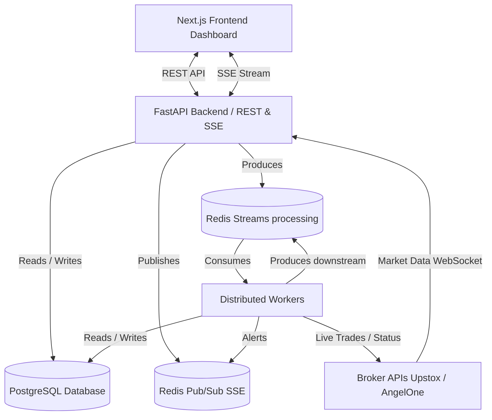
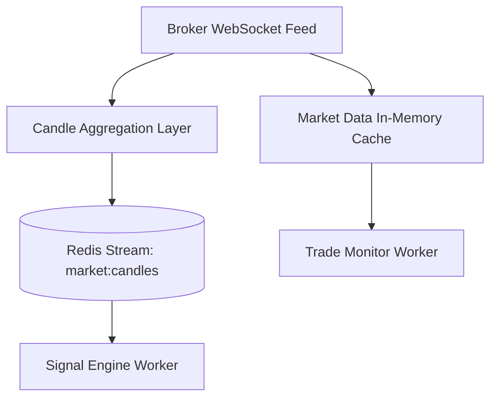
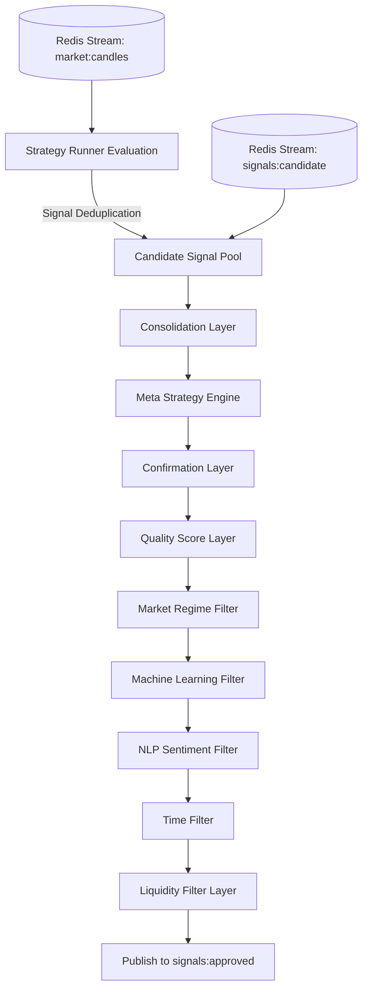
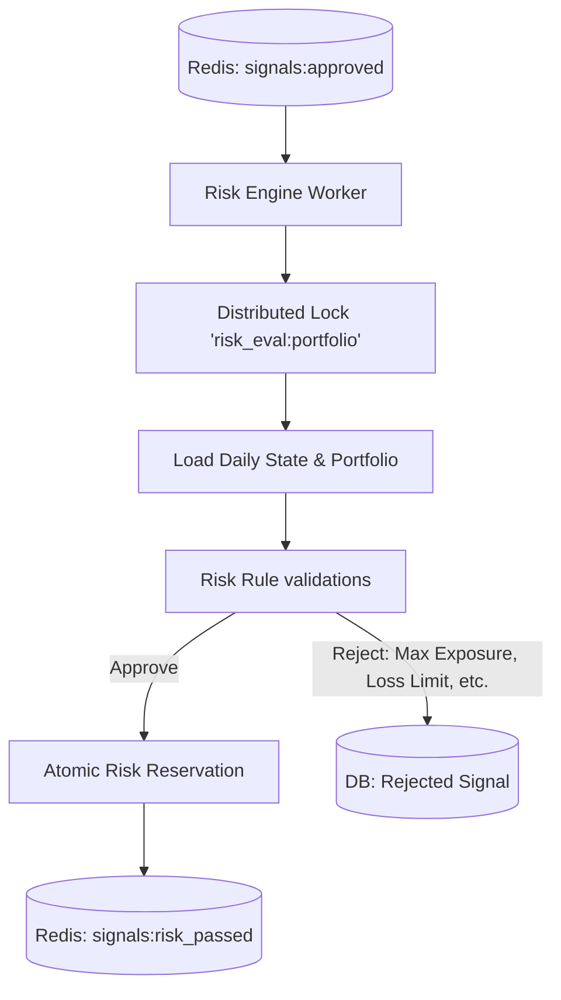
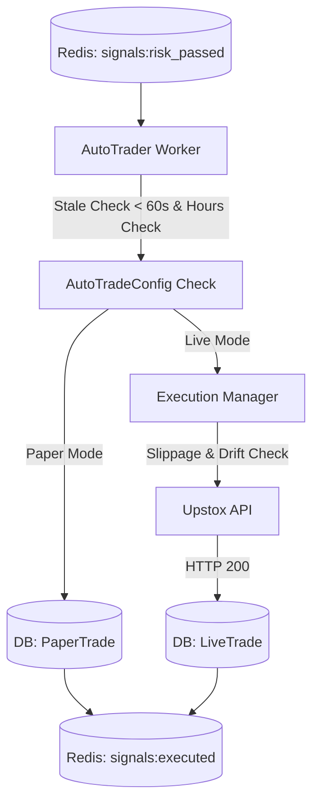
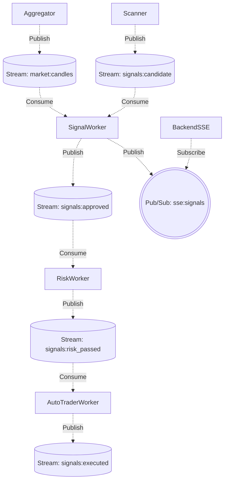
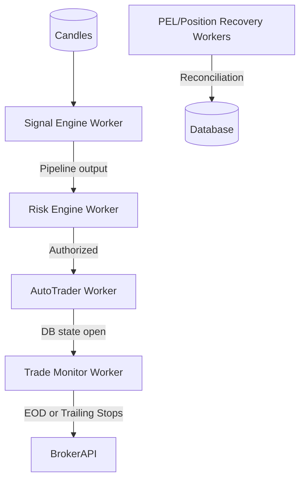
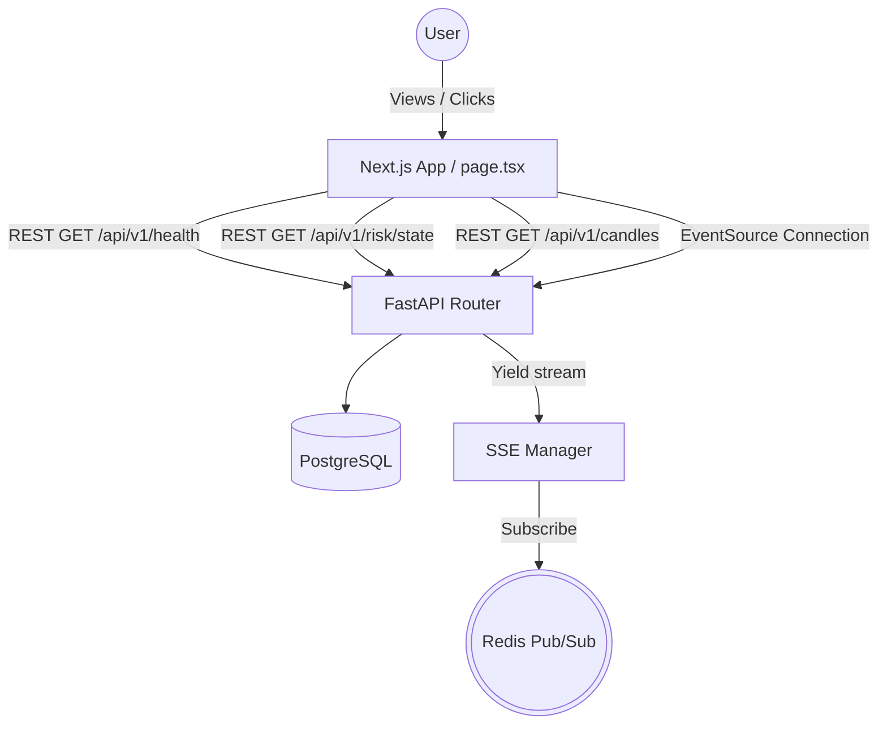
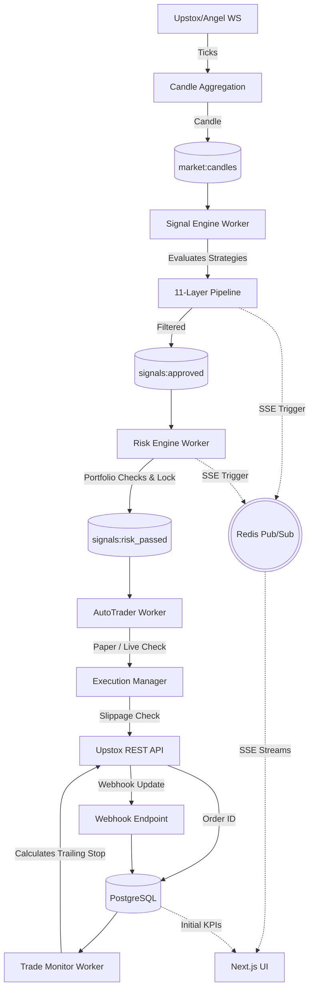

# QuantDSS Architecture Documentation

This document provides a comprehensive visual and technical overview of the QuantDSS system architecture, based on the actual repository implementation. It covers the high-level architecture, individual pipelines, asynchronous workflows, and data flows.

---

## 1. High Level System Architecture

The QuantDSS platform uses a distributed, event-driven architecture with FastAPI serving the backend, Next.js for the frontend, and standalone Python workers processing streams of market data via Redis.

**Component Explanation:**
- **Next.js Frontend:** Presents the dashboard, current P&L, risk state, live charts, and real-time signal feed.
- **FastAPI Backend:** Handles HTTP requests, orchestrates market data ingestion, manages database tables via SQLAlchemy, and serves the SSE real-time stream.
- **Redis Streams:** The backbone of the asynchronous message pipeline (`market:candles`, `signals:approved`, etc.).
- **Distributed Workers:** Independent Python processes (`signal_engine_worker`, `risk_engine_worker`, `autotrader_worker`, `trade_monitor_worker`) that distribute the computational load.
- **PostgreSQL Database:** The persistent source of truth containing configs, trade journals, paper trades, and daily risk states.
- **Broker APIs:** Upstox and AngelOne integration for market ticks, order placement, and webhooks.

---

## 2. Market Data Pipeline

Market data is ingested from the broker, converted to candles, and dispatched for strategy evaluation. 

**Explanation:**
- Raw ticks arrive via WebSocket and are instantly cached in `MarketDataCache` (used by [ExecutionManager](file:///c:/Users/Xaid/Desktop/My_project/QuantDSS/backend/app/engine/execution_manager.py#73-1077) for slippage/drift checks and [TradeMonitorWorker](file:///c:/Users/Xaid/Desktop/My_project/QuantDSS/backend/app/workers/trade_monitor_worker.py#39-378) for open position monitoring).
- `CandleAggregator` batches ticks into time-bucketed candles (e.g., 5-minute intervals).
- Candles are sent to the `market:candles` stream. If running in monolithic mode, an in-process `CandleConsumer` evaluates them; otherwise, the distributed [SignalEngineWorker](file:///c:/Users/Xaid/Desktop/My_project/QuantDSS/backend/app/workers/signal_engine_worker.py#36-309) pulls from the stream.

---

## 3. Signal Engine Pipeline

The signal intelligence pipeline evaluates trading strategies and refines signals through a strict 11-layer gauntlet.

**Explanation:**
- **Strategy Runner:** Applies 9+ technical strategies (EMA Crossover, RSI Mean Reversion, VWAP Reclaim, etc.) to incoming candles.
- **Signal Deduplication:** Prevents identical signals from flooding the system within a small window.
- **Pipeline Gauntlet:** Signals pass sequentially through various layers that consolidate related signals, apply meta-rules, score quality based on ATR/volume, determine market regime, evaluate ML/NLP probabilities, and filter out low-liquidity/wrong-time trades.
- At the end of the chain, surviving signals are published to the `signals:approved` stream.

*(Note: Depending on distributed vs. monolithic mode, [signal_engine_worker.py](file:///c:/Users/Xaid/Desktop/My_project/QuantDSS/backend/app/workers/signal_engine_worker.py) dynamically wires these callbacks together.)*

---

## 4. Risk Engine Flow

The comprehensive risk validation process prevents excessive exposure and enforces daily loss limits.

**Explanation:**
- The [RiskEngineWorker](file:///c:/Users/Xaid/Desktop/My_project/QuantDSS/backend/app/workers/risk_engine_worker.py#42-303) consumes the approved signals.
- It acquires a distributed Redis lock (`risk_eval:portfolio`) to prevent race conditions during risk portfolio evaluation.
- It loads the `DailyRiskState` (today's P&L, blocked signals count) and `Portfolio` (virtual or live balance, open positions).
- Various checks are applied: **Stale signal check (max 300s age)**, **Max Weekly/Daily Loss limits**, **Max Position Pct**, **Correlated positions**, and **Cooldown periods**.
- If approved, risk is atomically reserved in Redis (to prevent concurrent trade over-allocation) and the signal flies to `signals:risk_passed`.

---

## 5. Execution Pipeline

Translates approved and risk-verified signals into physical broker orders or simulated paper trades.

**Explanation:**
- [AutoTraderWorker](file:///c:/Users/Xaid/Desktop/My_project/QuantDSS/backend/app/workers/autotrader_worker.py#45-331) pulls from `signals:risk_passed`. It uses an idempotency key to prevent double execution.
- Depending on the database `AutoTradeConfig` (Paper or Live mode), it splits logic.
- **Paper Mode:** Simulates order execution against virtual balance and logs to `PaperTrades`.
- **Live Mode:** Dispatches to [ExecutionManager](file:///c:/Users/Xaid/Desktop/My_project/QuantDSS/backend/app/engine/execution_manager.py#73-1077). It checks LTP drift (to prevent execution on stale signal price) and submits an Intraday LIMIT order to Upstox.
- Both modes publish a final receipt to `signals:executed`.

---

## 6. Message Queue Architecture

An overview of the Redis Pub/Sub and Streams topography connecting the decoupled services.

**Explanation:**
- Redis Streams acts as a durable log for the primary event lifecycle (Ingestion → Intelligence → Risk → Execution).
- Redis Pub/Sub (`sse:signals`) is used exclusively for ephemeral, low-latency UI updates (Server-Sent Events) so the dashboard sees the signal instantly without polling.

---

## 7. Worker Architecture

The background processing ecosystem handles asynchronous tasks independently from the UI.

**Explanation:**
- **Signal Engine Worker:** Heavy compute. Evaluates DataFrame strategies. 
- **Risk Engine Worker:** Stateful logic. Manages lock contention and portfolio exposure limits.
- **AutoTrader Worker:** Connects to broker. Manages live execution state and errors.
- **Trade Monitor Worker:** A polling loop (every 15s) checking open trades. It calculates Trailing Stops, detects SL hits locally (fallback), and manages EOD 15:15 market close logic.
- **Position Reconcilers & Recovery Workers:** Run asynchronously or at startup to reconcile pending orders and recover from crashes.

---

## 8. Frontend Dashboard Flow

How the UI interacts with the backend to stay entirely responsive without pageloads.

**Explanation:**
- On initial load, the dashboard fetches static KPIs (Today's PNL, Open Positions, System Health) via standard REST API calls to the FastAPI backend.
- It establishes a continuous connection via `EventSource` to the SSE endpoint.
- As workers perform actions and publish to `sse:signals`, the SSE manager loops those messages directly back out to the React components (`setSignals`), rendering UI feed updates in real-time.

---

## 9. Complete End-to-End System Flow

The complete lifecycle from the moment a stock's price changes at the broker to the moment the dashboard updates.

**Key Takeaways:**
- **Decoupled:** Each phase operates on its own loop/stream. A crash in execution does not halt data ingestion or signal generation.
- **Stateful Safety:** Trade state is tracked precisely in the PostgreSQL [live_trades](file:///c:/Users/Xaid/Desktop/My_project/QuantDSS/backend/app/workers/trade_monitor_worker.py#200-292) table. Webhooks and secondary polling (`Trade Monitor`) ensure no trade is left 'naked'.
- **Transparent:** The [SSEManager](file:///c:/Users/Xaid/Desktop/My_project/QuantDSS/backend/app/alerts/sse_manager.py#14-95) ensures every worker can inform the frontend effortlessly via Redis Pub/Sub, delivering a premium user experience on the React dashboard.
